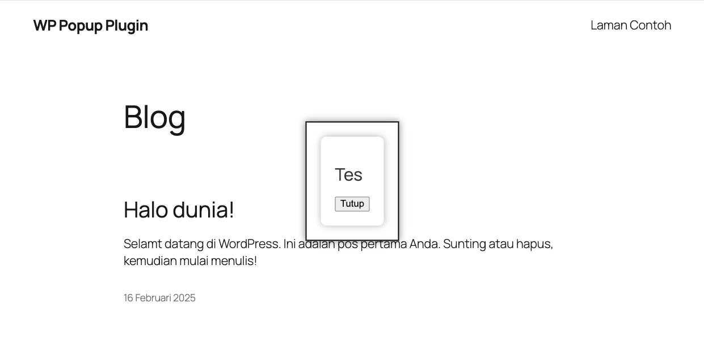

# WordPress Popup Plugin

Plugin ini memungkinkan Anda untuk menampilkan pop-up interaktif di situs WordPress Anda menggunakan custom post types, REST API, dan React.js untuk frontend. Pop-up ini dapat disesuaikan dan dipicu berdasarkan data yang disimpan dalam post tipe `wp_popup`. Plugin ini sangat cocok untuk menampilkan tawaran, pengumuman, atau informasi penting lainnya.

## Fitur Utama

- **Custom Post Type (CPT)**: Pop-up dikelola melalui custom post type `wp_popup`.
- **REST API**: Data pop-up dapat diambil melalui API untuk ditampilkan di frontend.
- **Frontend React.js**: Menggunakan React.js untuk membuat tampilan pop-up dinamis dan interaktif.
- **Pengaturan Tampilan Pop-up**: Pop-up dapat disesuaikan menggunakan CSS dan SCSS.
- **Pengaturan Halaman Pop-up**: Pop-up dapat dikaitkan dengan halaman tertentu melalui custom field.

## Prasyarat

Sebelum menginstal dan menggunakan plugin, pastikan Anda telah menyiapkan lingkungan berikut:

- **WordPress** versi 5.0 atau lebih tinggi.
- **PHP** versi 7.2 atau lebih tinggi.
- **Composer** untuk mengelola dependensi PHP.
- **Node.js** dan **npm** untuk pengelolaan frontend.
- **WP CLI** untuk mempermudah instalasi dan pengelolaan plugin.

## Instalasi dan Aktivasi

### 1. Mengunduh dan Menginstal Plugin

1. Unduh plugin atau gunakan WP CLI untuk menginstalnya.

   **Melalui WP CLI**:

   - Pindah ke direktori `wp-content/plugins` dari instalasi WordPress Anda.
   - Unduh dan instal plugin menggunakan perintah berikut:
     ```bash
     wp plugin install path-to-plugin/wordpress-popup-plugin.zip --activate
     ```

   **Secara Manual**:

   - Ekstrak file plugin dan unggah ke direktori `wp-content/plugins/wordpress-popup-plugin/` pada server WordPress Anda.
   - Aktifkan plugin melalui **Dashboard > Plugins**.

### 2. Aktifkan Plugin

Setelah plugin berhasil diinstal, aktifkan plugin melalui menu **Dashboard > Plugins** atau dengan perintah WP CLI:

```bash
wp plugin activate wordpress-popup-plugin
```

````

### 3. Mengaktifkan Pop-up di Halaman Tertentu

- Plugin secara otomatis akan menambahkan custom post type `wp_popup`. Anda dapat membuat pop-up baru dari menu **Pop Ups** di dashboard WordPress.
- Setiap pop-up dapat memiliki konten yang berbeda dan disesuaikan dengan halaman tertentu melalui custom field `page`.

## Menambahkan Pop-up Baru

1. Pergi ke **Dashboard > Pop Ups**.
2. Klik **Add New** untuk membuat pop-up baru.
3. Masukkan konten pop-up dan tentukan halaman mana yang akan memicu pop-up ini dengan menambahkan custom field `page` di bawah editor konten. Misalnya, Anda dapat menambahkan `homepage` untuk pop-up yang hanya muncul di halaman beranda.
4. Simpan perubahan.

## Penggunaan REST API

Plugin ini menyediakan **REST API** untuk mengambil data pop-up yang ditampilkan.

### Endpoint: `/wp-json/artistudio/v1/popup`

#### Metode: `GET`

#### Response:

```json
[
  {
    "id": 123,
    "title": "Special Offer!",
    "content": "Get a 20% discount on your first order!",
    "page": "homepage"
  }
]
```

Endpoint ini akan mengembalikan semua pop-up yang diterbitkan dan siap ditampilkan. Anda dapat menggunakan `page` untuk memfilter pop-up yang hanya ditampilkan di halaman tertentu.

## Struktur Kode Plugin

Plugin ini terdiri dari beberapa file utama yang memiliki fungsinya masing-masing.

### 1. `wordpress-popup-plugin.php`

Plugin utama yang menangani inisialisasi dan konfigurasi dasar plugin.

```php
<?php

/**
 * Plugin Name:     WordPress Popup Plugin
 * Plugin URI:      https://github.com/username/wp-popup-plugin
 * Description:     Plugin pop-up menggunakan WP REST API dan React
 * Author:          Nama Anda
 * Author URI:      https://github.com/username
 * Text Domain:     wordpress-popup-plugin
 * Domain Path:     /languages
 * Version:         1.0.0
 *
 * @package         Wordpress_Popup_Plugin
 */

if (!defined('ABSPATH')) {
    exit;
}

// Load REST API Class
require_once plugin_dir_path(__FILE__) . 'includes/class-wp-popup-api.php';

final class WP_Popup_Plugin
{
    private static $instance = null;

    public static function get_instance()
    {
        if (self::$instance === null) {
            self::$instance = new self();
        }
        return self::$instance;
    }

    private function __construct()
    {
        $this->define_hooks();
    }

    private function define_hooks()
    {
        add_action('init', array($this, 'register_cpt_popup'));
        add_action('wp_enqueue_scripts', array($this, 'enqueue_scripts'));
        add_action('plugins_loaded', array($this, 'load_textdomain'));

        // Hook aktivasi & deaktivasi hanya didaftarkan satu kali
        register_activation_hook(__FILE__, array($this, 'on_activation'));
        register_deactivation_hook(__FILE__, array($this, 'on_deactivation'));
    }

    public function register_cpt_popup()
    {
        $args = array(
            'labels'             => array(
                'name'          => __('Pop Ups', 'wordpress-popup-plugin'),
                'singular_name' => __('Pop Up', 'wordpress-popup-plugin'),
            ),
            'public'             => true,
            'has_archive'        => false,
            'supports'           => array('title', 'editor', 'custom-fields'),
            'show_in_rest'       => true,
            'menu_position'      => 20,
            'menu_icon'          => 'dashicons-format-aside',
        );

        register_post_type('wp_popup', $args);
    }

    public function enqueue_scripts()
    {
        if (!is_admin()) {
            wp_enqueue_script(
                'wp-popup-script',
                plugin_dir_url(__FILE__) . 'assets/js/popup.bundle.js',
                array('wp-element'),
                filemtime(plugin_dir_path(__FILE__) . 'assets/js/popup.bundle.js'),
                true
            );

            wp_enqueue_style(
                'wp-popup-style',
                plugin_dir_url(__FILE__) . 'assets/css/popup.css',
                array(),
                filemtime(plugin_dir_path(__FILE__) . 'assets/css/popup.css')
            );

            wp_localize_script('wp-popup-script', 'wpPopup', array(
                'nonce'  => wp_create_nonce('wp_rest'),
                'apiUrl' => rest_url('artistudio/v1/popup')
            ));
        }
    }

    public function load_textdomain()
    {
        load_plugin_textdomain('wordpress-popup-plugin', false, dirname(plugin_basename(__FILE__)) . '/languages');
    }

    public function on_activation()
    {
        $this->register_cpt_popup();
        flush_rewrite_rules();
    }

    public function on_deactivation()
    {
        flush_rewrite_rules();
    }
}

// Inisialisasi Plugin
WP_Popup_Plugin::get_instance();
```

### 2. `includes/class-wp-popup-api.php`

Kode ini menangani API yang digunakan untuk mengambil data pop-up.

```php
<?php
if (!defined('ABSPATH')) {
    exit;
}

class WP_Popup_API
{
    public function __construct()
    {
        add_action('rest_api_init', array($this, 'register_api_endpoints'));
    }

    public function register_api_endpoints()
    {
        register_rest_route('artistudio/v1', '/popup/', array(
            'methods'  => 'GET',
            'callback' => array($this, 'get_popup_data'),
            'permission_callback' => '__return_true'
        ));
    }

    public function get_popup_data()
    {
        $args = array(
            'post_type'      => 'wp_popup',
            'posts_per_page' => -1,
            'post_status'    => 'publish',
        );

        $query = new WP_Query($args);
        $popups = [];

        if ($query->have_posts()) {
            while ($query->have_posts()) {
                $query->the_post();
                $popups[] = array(
                    'id'      => get_the_ID(),
                    'title'   => get_the_title(),
                    'content' => apply_filters('the_content', get_the_content()),
                    'page'    => get_post_meta(get_the_ID(), 'page', true),
                );
            }
        }

        wp_reset_postdata(); // Reset post data

        if (empty($popups)) {
            return new WP_Error('no_popup', 'Tidak ada pop-up yang tersedia.', array('status' => 404));
        }

        return rest_ensure_response($popups);
    }
}

new WP_Popup_API();
```

### 3. `assets/js/popup.js` dan `popup.bundle.js`

File JavaScript ini menangani pengambilan data pop-up melalui API dan menampilkannya di frontend.

```javascript
// popup.js
document.addEventListener("DOMContentLoaded", function () {
  fetch("/wp-json/artistudio/v1/popup", {
    credentials: "include",
    headers: {
      "X-WP-Nonce": wpPopup.nonce,
    },
  })
    .then((response) => response.json())
    .then((data) => {
      if (Array.isArray(data) && data.length > 0) {
        let popup = document.createElement("div");
        popup.id = "popup-container";
        popup.innerHTML = `
                <div class="popup-content">
                    <span id="popup-close">&times;</span>
                    ${data[0].content.rendered}
                </div>
            `;

        document.body.appendChild(popup);

        document
          .getElementById("popup-close")
          .addEventListener("click", function () {
            document.getElementById("popup-container").remove();
          });
      }
    })
    .catch((error) => console.error("Error fetching popup:", error));
});
```

## Pengujian

- **Cek apakah pop-up muncul di halaman yang sesuai** berdasarkan nilai `page` yang ditentukan dalam post.
- **Verifikasi akses REST API** hanya dengan autentikasi yang benar.
- **Tes Responsivitas**: Pastikan pop-up berfungsi dengan baik di berbagai ukuran layar.

## Lisensi

Plugin ini dilisensikan di bawah **MIT License**. Anda bebas untuk menggunakannya, memodifikasinya, dan mendistribusikannya sesuai dengan ketentuan lisensi MIT.

##

Kontribusi

Kami menerima kontribusi untuk plugin ini. Jika Anda memiliki ide atau perbaikan, silakan buka **Pull Request** atau buat **Issue** di [GitHub](https://github.com/username/wp-popup-plugin).

## Pengembang

- **Nama**: [Nama Anda]
- **GitHub**: [https://github.com/username](https://github.com/username)

## Hasil



````
